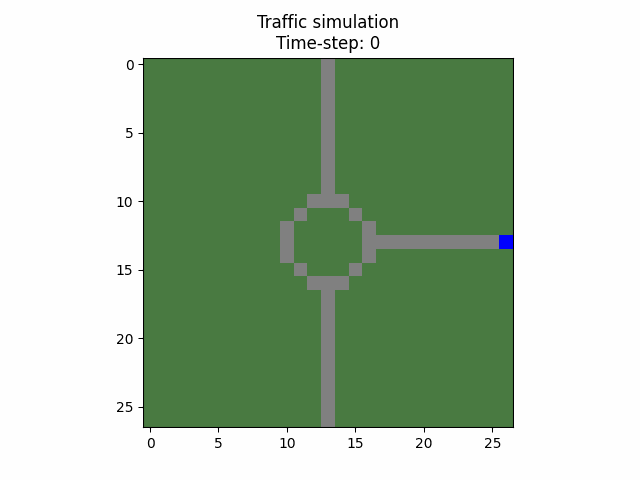

# Multiagent Traffic Modeling

## Authors
- Javier Sánchez Panduro [@javiersanpan](https://github.com/javiersanpan)
- Lizeth García [@lizgr01](https://github.com/lizgr01)
- María Carelia Ibarra Vasquez [@kreiji](https://github.com/kreiji)
- Emilio Vazquez [@BronzyChief](https://github.com/BronzyChief)

## About

This project has been modeled using the agentpy library. It uses a grid environment and has three types of agents: cars, roads and stoplights. As of now, it works using two agents and two roads, but this behaviour can be modified.

Features
* Multiple car agent traverse road agents marked as untravelled
* Roads can be marked as travelled and untravelled
* Stoplights control de behaviour of specific car agent

### Animation of successful model:



## Requirements

Both Conda and PIP are used to install requirements. 

Run the following to install requirements
```
conda install --file requirementsCONDA.txt

pip install -r requirementsPIP.txt
```