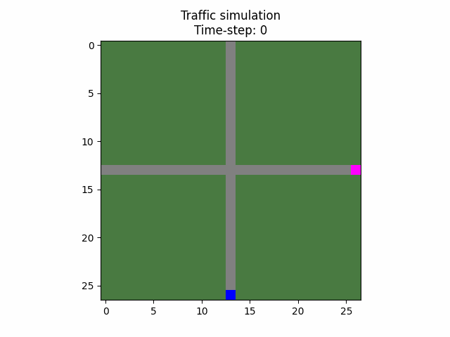

# Multiagent Traffic Modeling

## About

This project has been modeled using the agentpy library. It uses a grid environment and has three types of agents: cars, roads and stoplights. As of now, it works using two agents and two roads, but this behaviour can be modified.

Features
* Multiple car agent traverse road agents marked as untravelled
* Roads can be marked as travelled and untravelled
* Stoplights control de behaviour of specific car agent

### Animation of successful model:



## Requirements

Both Conda and PIP are used to install requirements. 

Run the following to install requirements
```
conda install --file requirementsCONDA.txt

pip install -r requirementsPIP.txt
```

## Parameters

You can change the parameters in main to generate a new model. These are the variables and their supported ranges:

**Canvas size**

size = 27

**Roundabout ratio**

ratio >= 3 and ratio <= 12

**Roundabout center**

vertical_center >= ratio + 1
vertical_center <= size - ratio - 2

horizontal_center >= ratio + 1
horizontal_center <= size - ratio - 2

**Draw background road so roundabout looks complete regardless of if a car traverses it** 

draw_background : boolean

**Begin and end points**

*Do not change at the moment, WIP*
